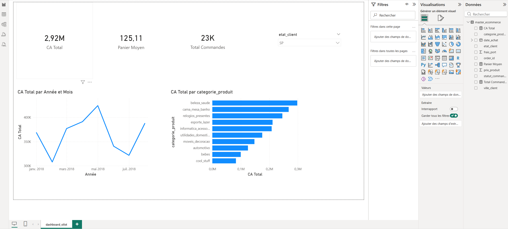

# Tableau de Bord E-commerce : Analyse des Performances (Olist)

## 📌 Contexte du Projet
Ce projet de Business Intelligence vise à transformer la base de données brute d'un acteur majeur du e-commerce brésilien (Olist) en un outil d'aide à la décision interactif. L'objectif est de permettre aux équipes commerciales de suivre le chiffre d'affaires, le volume de commandes et les catégories de produits les plus performantes.

## 🛠️ Outils et Technologies utilisés
* **Extraction & Modélisation (ETL) :** Python (Pandas) et SQL (Jointures multiples sur 4 tables distinctes).
* **Business Intelligence :** Power BI.
* **Langages :** SQL, DAX (Data Analysis Expressions).

## ⚙️ Méthodologie

### 1. Modélisation des données (Data Warehouse)
Les données brutes étaient réparties dans plusieurs tables relationnelles. J'ai utilisé SQL pour créer une table maître consolidée en effectuant des jointures (`JOIN`) entre les commandes, les articles, les clients et les produits, tout en filtrant uniquement les commandes livrées (`WHERE order_status = 'delivered'`).

### 2. Création des KPIs avec DAX
Pour rendre le tableau de bord dynamique, j'ai programmé des mesures explicites en DAX :
* `CA Total = SUM(master_ecommerce[prix_produit])`
* `Total Commandes = DISTINCTCOUNT(master_ecommerce[order_id])`
* `Panier Moyen = DIVIDE([CA Total], [Total Commandes], 0)`

### 3. Data Visualization
Conception d'un tableau de bord interactif comprenant :
* Des **Cartes (KPIs)** pour une lecture immédiate des performances globales.
* Un **Graphique en courbes chronologique** avec hiérarchie de dates pour analyser la saisonnalité des ventes.
* Un **Graphique à barres (Top 10)** pour identifier les catégories de produits générant le plus de revenus.
* Des **Segments (Slicers)** permettant aux utilisateurs de filtrer dynamiquement les résultats par État géographique.

## 📊 Aperçu du Dashboard

> **Note :** Le fichier `.pbix` complet ainsi que le script SQL/Python de préparation des données sont disponibles dans ce dépôt.
